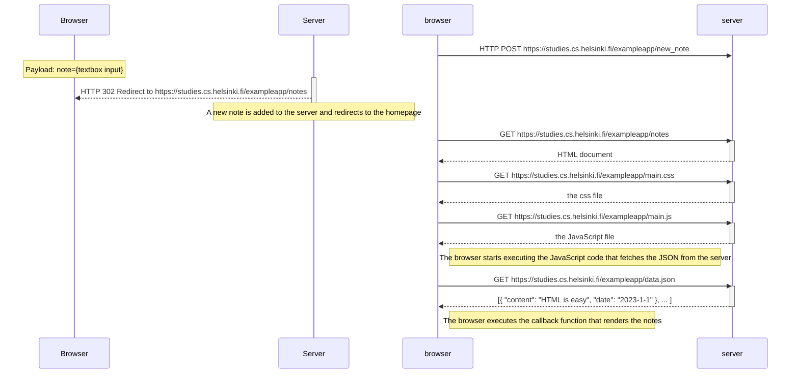

```mermaid
sequenceDiagram
    participant Browser
    participant Server

    browser->>server: HTTP POST https://studies.cs.helsinki.fi/exampleapp/new_note
    Note over Browser: Payload: note={textbox input}
    activate Server
    Server-->>Browser: HTTP 302 Redirect to https://studies.cs.helsinki.fi/exampleapp/notes
    Note over Server: A new note is added to the server and redirects to the homepage
    deactivate Server

    browser->>server: GET https://studies.cs.helsinki.fi/exampleapp/notes
    activate server
    server-->>browser: HTML document
    deactivate server

    browser->>server: GET https://studies.cs.helsinki.fi/exampleapp/main.css
    activate server
    server-->>browser: the css file
    deactivate server

    browser->>server: GET https://studies.cs.helsinki.fi/exampleapp/main.js
    activate server
    server-->>browser: the JavaScript file
    deactivate server

    Note right of browser: The browser starts executing the JavaScript code that fetches the JSON from the server

    browser->>server: GET https://studies.cs.helsinki.fi/exampleapp/data.json
    activate server
    server-->>browser: [{ "content": "HTML is easy", "date": "2023-1-1" }, ... ]
    deactivate server

    Note right of browser: The browser executes the callback function that renders the notes
```