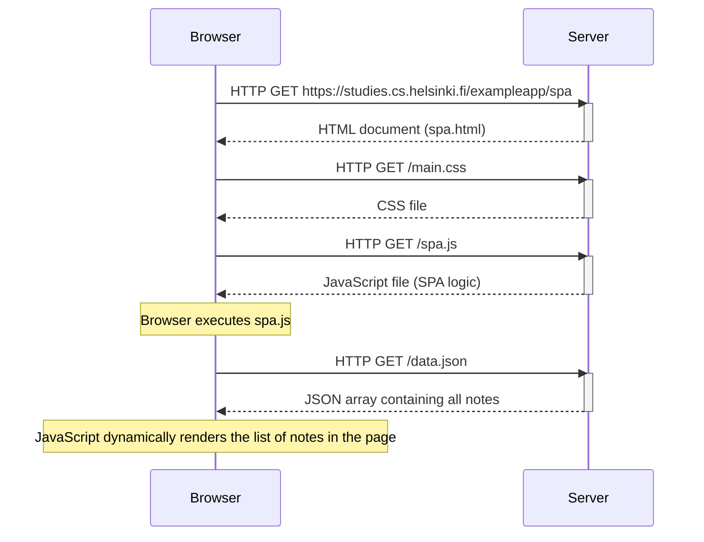

```mermaid
sequenceDiagram
    participant Browser
    participant Server

    Browser->>Server: HTTP GET https://studies.cs.helsinki.fi/exampleapp/spa
    activate Server
    Server-->>Browser: HTML document (spa.html)
    deactivate Server

    Browser->>Server: HTTP GET /main.css
    activate Server
    Server-->>Browser: CSS file
    deactivate Server

    Browser->>Server: HTTP GET /spa.js
    activate Server
    Server-->>Browser: JavaScript file (SPA logic)
    deactivate Server

    Note over Browser: Browser executes spa.js

    Browser->>Server: HTTP GET /data.json
    activate Server
    Server-->>Browser: JSON array containing all notes
    deactivate Server

    Note over Browser: JavaScript dynamically renders the list of notes in the page
```