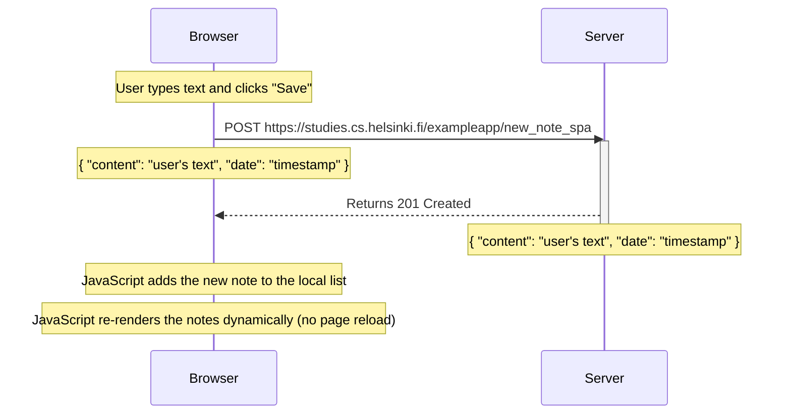

```mermaid
sequenceDiagram
    participant Browser
    participant Server

    Note over Browser: User types text and clicks "Save"

    Browser->>Server: POST https://studies.cs.helsinki.fi/exampleapp/new_note_spa
    activate Server
    Note over Browser: { "content": "user's text", "date": "timestamp" }

    Server-->>Browser: Returns 201 Created
    Note over Server: { "content": "user's text", "date": "timestamp" }
    deactivate Server

    Note over Browser: JavaScript adds the new note to the local list

    Note over Browser: JavaScript re-renders the notes dynamically (no page reload)
```