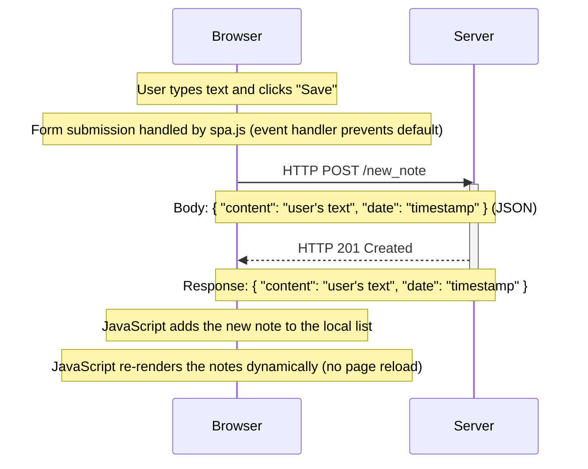

```mermaid
sequenceDiagram
    participant b as Browser
    participant s as Server

    Note over b: User types text and clicks "Save"
    Note over b: Form submission handled by spa.js (event handler prevents default)

    b->>s: HTTP POST /new_note
    activate s
    Note over b,s: Body: { "content": "user's text", "date": "timestamp" } (JSON)
    s-->>b: HTTP 201 Created
    Note over b,s: Response: { "content": "user's text", "date": "timestamp" }
    deactivate s

    Note over b: JavaScript adds the new note to the local list

    Note over b: JavaScript re-renders the notes dynamically (no page reload)
```