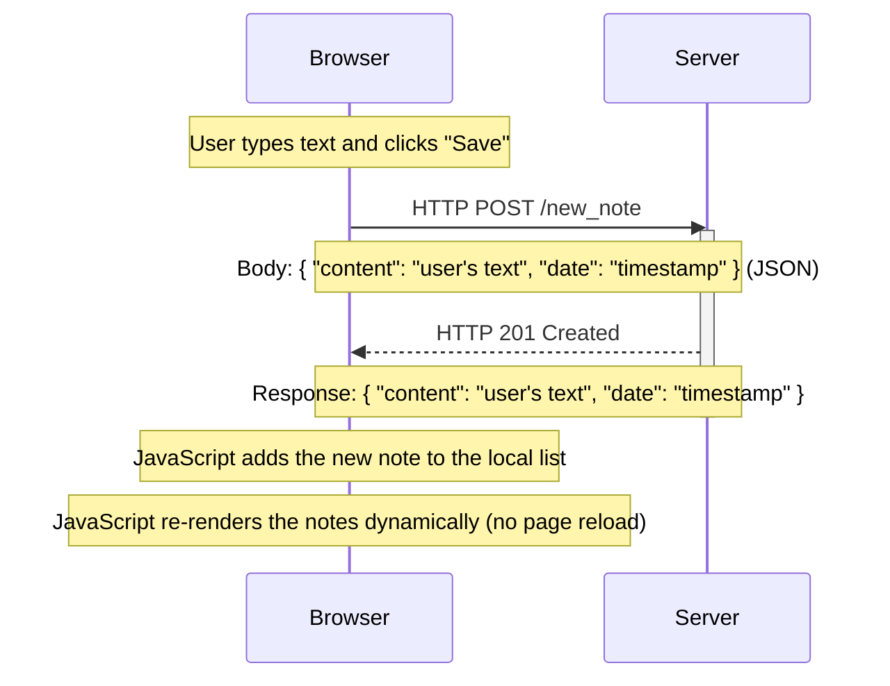

```mermaid
sequenceDiagram
    participant Browser
    participant Server

    Note over Browser: User types text and clicks "Save"

    Browser->>Server: HTTP POST /new_note
    activate Server
    Note over Browser,Server: Body: { "content": "user's text", "date": "timestamp" } (JSON)
    
    Server-->>Browser: HTTP 201 Created
    Note over Browser,Server: Response: { "content": "user's text", "date": "timestamp" }
    deactivate Server

    Note over Browser: JavaScript adds the new note to the local list

    Note over Browser: JavaScript re-renders the notes dynamically (no page reload)
```